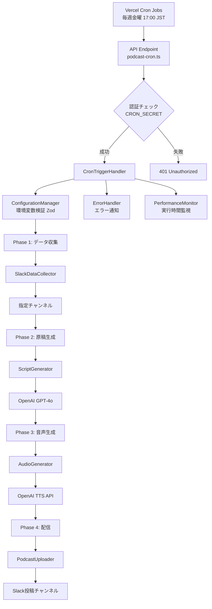

# AI ポッドキャスト自動生成システム

Slack メッセージを元に、AI が自動でポッドキャストを生成・配信するシステムです。

## 📖 目次

- [概要](#概要)
- [前提条件](#前提条件)
- [プロジェクト構成](#プロジェクト構成)
- [実行フロー](#実行フロー)
- [セットアップ](#セットアップ)
- [ローカルテスト](#ローカルテスト)
- [デプロイ](#デプロイ)
- [カスタマイズ](#カスタマイズ)
- [トラブルシューティング](#トラブルシューティング)
- [関連ドキュメント](#関連ドキュメント)

## 概要

このシステムは、Slack チャンネルのメッセージを収集し、AI を使って自動的にポッドキャストを生成します。毎週金曜日 17:00（JST）に自動実行され、生成されたポッドキャストは指定した Slack チャンネルに配信されます。

### 主な機能

- 📅 **自動実行**: 定期的に自動実行（Vercel Cron Jobs）
- 💬 **Slack データ収集**: 指定したチャンネルから過去 7 日間のメッセージを収集
- 🤖 **AI 原稿生成**: OpenAI GPT-4o で明るく楽しいラジオ DJ 風の原稿を生成（約 1500 文字）
- 🎙️ **音声化**: OpenAI TTS API で音声化（alloy voice, 1.1 倍速, MP3 形式）
- 📤 **Slack 配信**: 生成した MP3 を Slack チャンネルに自動アップロード
- 🔒 **セキュリティ**: 環境変数バリデーション（Zod）、認証（CRON_SECRET）

## 前提条件

このシステムを使用するには、以下が必要です：

### 1. OpenAI API Key

- [OpenAI Platform](https://platform.openai.com/api-keys) でアカウントを作成
- **重要**: OpenAI API を使用するには、**最低 5 ドル分の課金**が必要です
  - GPT-4o（原稿生成）と TTS（音声生成）の両方を使用するため
  - 1 回の実行で約 $0.05 〜 $0.10 程度のコストがかかります
- API Key を取得（`sk-` で始まる文字列）

### 2. Slack ワークスペース

- Slack App を作成できる権限
- ポッドキャストを配信するチャンネル

### 3. Vercel アカウント（デプロイ用）

- [Vercel](https://vercel.com) でアカウントを作成（無料プラン可）
- GitHub アカウントと連携

### 4. 開発環境

- **Bun**: JavaScript ランタイム（[インストール方法](https://bun.sh)）
- **Git**: バージョン管理

## プロジェクト構成

```
AI-Podcast/
├── api/
│   └── podcast-cron.ts              # Vercel Functions エンドポイント
├── src/
│   ├── constants/
│   │   ├── index.ts                 # 定数定義
│   │   └── prompts.ts               # プロンプトテンプレート
│   ├── handlers/
│   │   └── CronTriggerHandler.ts    # メインハンドラー
│   ├── schemas/
│   │   └── env.schema.ts            # 環境変数スキーマ（Zod）
│   ├── services/
│   │   ├── SlackDataCollector.ts    # Slack データ収集
│   │   ├── ScriptGenerator.ts       # 原稿生成（GPT-4o）
│   │   ├── AudioGenerator.ts        # 音声生成（OpenAI TTS）
│   │   └── PodcastUploader.ts       # Slack 配信
│   ├── types/
│   │   └── index.ts                 # 型定義
│   └── utils/
│       ├── ConfigurationManager.ts  # 環境変数管理
│       ├── ErrorHandler.ts          # エラー処理
│       ├── PerformanceMonitor.ts    # パフォーマンス監視
│       └── retry.ts                 # リトライロジック
├── examples/
│   ├── CUSTOMIZATION.md             # カスタマイズガイド
│   ├── SLACK_SETUP.md               # Slack App セットアップガイド
│   └── SAMPLE_SLACK_MESSAGES.md     # テスト用ダミーデータ（30メッセージ）
├── .env.example                     # 環境変数サンプル
├── package.json
├── tsconfig.json
└── vercel.json                      # Vercel 設定（Cron 含む）
```

## 実行フロー

システムは以下の 4 つのフェーズで動作します：



### フェーズ詳細

1. **Phase 1: データ収集**（約 5 秒）

   - 指定したチャンネルから過去 7 日間のメッセージを取得
   - 最大 50 メッセージまで収集

2. **Phase 2: 原稿生成**（約 10〜20 秒）

   - GPT-4o を使って約 1500 文字のラジオ DJ 風原稿を生成
   - 機密情報を自動フィルタリング

3. **Phase 3: 音声生成**（約 10〜30 秒）

   - OpenAI TTS で原稿を音声化
   - 約 3〜5 分の MP3 ファイルを生成

4. **Phase 4: 配信**（約 5 秒）
   - 生成した MP3 を Slack チャンネルにアップロード
   - 再生時間とファイルサイズを表示

**合計実行時間**: 約 30〜60 秒

## セットアップ

### 1. リポジトリのクローン

```bash
git clone git@github.com:yama-shoki/ai-podcast-template.git
cd ai-podcast-template
```

### 2. 依存関係のインストール

```bash
bun install
```

### 3. 環境変数の設定

#### 3.1 `.env` ファイルを作成

```bash
cp .env.example .env
```

#### 3.2 必要な環境変数を設定

`.env` ファイルを編集して、以下の値を設定します：

| 変数名                  | 説明                                | バリデーション          | 取得方法                                                        |
| ----------------------- | ----------------------------------- | ----------------------- | --------------------------------------------------------------- |
| `SLACK_BOT_TOKEN`       | Slack Bot Token                     | `xoxb-`で始まる必要あり | [Slack App セットアップガイド](./examples/SLACK_SETUP.md) 参照           |
| `SLACK_CHANNEL_SOURCE`  | データ収集元チャンネル ID           | 1 文字以上              | チャンネルを右クリック → 「詳細を表示」→ チャンネル ID をコピー |
| `SLACK_PODCAST_CHANNEL` | 配信先チャンネル ID                 | 1 文字以上              | 同上                                                            |
| `OPENAI_API_KEY`        | OpenAI API Key（GPT-4o+TTS）        | `sk-`で始まる必要あり   | [OpenAI Platform](https://platform.openai.com/api-keys)         |
| `CRON_SECRET`           | Cron Job 認証用（**セキュリティ**） | **32 文字以上**必須     | `openssl rand -base64 32`で生成                                 |

#### 3.3 CRON_SECRET の生成方法

```bash
openssl rand -base64 32
```

生成された文字列を `.env` の `CRON_SECRET` に貼り付けてください。

#### 3.4 Slack App のセットアップ

Slack App の作成と Bot Token の取得方法は、**[Slack App セットアップガイド](./examples/SLACK_SETUP.md)** を参照してください。

### 4. ビルド確認

```bash
bun run type-check  # 型チェック
bun run lint        # Lint
bun run build       # ビルド
```

すべてのコマンドがエラーなく完了することを確認してください。

## ローカルテスト

デプロイ前にローカル環境でシステムをテストできます：

```bash
bun run test:local
```

このコマンドは CronTriggerHandler を直接実行し、システム全体の動作を確認します。

**特徴**:

- ✅ 完全にローカルで実行（本番環境に影響なし）
- ✅ Vercel プロジェクトのセットアップ不要
- ✅ 詳細な実行ログとテスト結果を表示
- ⚠️ Slack と OpenAI API には実際に接続（課金発生）

### ローカルテストの注意事項

1. **環境変数**: `.env` ファイルが正しく設定されていることを確認
2. **Slack チャンネル**: テスト用チャンネルを使用することを推奨
3. **OpenAI API コスト**: ローカルテストでも API が呼ばれ、課金されます（約 $0.10 〜 $0.20 / 回）
4. **実行時間**: 初回は 30〜60 秒程度かかります

### デバッグログの確認

実行中のログで各フェーズの進行状況を確認できます：

```
[ConfigurationManager] ✅ Environment variables validated successfully
[SlackDataCollector] Collecting messages from past 7 days...
[SlackDataCollector] Collected 30 messages
[ScriptGenerator] Generating script from 30 messages
[ScriptGenerator] Generated script: 1523 characters (target: 1500)
[AudioGenerator] Generating audio from 1523 character script
[AudioGenerator] Generated audio: 245760 bytes, ~15s
[PodcastUploader] Publishing podcast to channel CXXXXXXXXX
[PodcastUploader] Successfully published podcast: https://...
✅ ポッドキャスト生成完了
```

## デプロイ

初回実行時はプロジェクトのセットアップが行われます。指示に従って進めてください。

### 1. 環境変数の設定

Vercel Dashboard で環境変数を設定します：

1. [Vercel Dashboard](https://vercel.com/dashboard) にアクセス
2. プロジェクトを選択
3. **Settings** → **Environment Variables**
4. `.env` ファイルの内容を入力：
   - `SLACK_BOT_TOKEN`
   - `SLACK_CHANNEL_SOURCE`
   - `SLACK_PODCAST_CHANNEL`
   - `OPENAI_API_KEY`
   - `CRON_SECRET`

### 2. Cron Job の確認

Vercel Dashboard で以下を確認：

1. **Settings** → **Cron Jobs**
2. `/api/podcast-cron` が毎週金曜 8:00 UTC (17:00 JST) に設定されていることを確認
3. 必要に応じてスケジュールを変更可能（`vercel.json` を編集）

## カスタマイズ

システムをカスタマイズする方法は、**[カスタマイズガイド](./examples/CUSTOMIZATION.md)** を参照してください。

- 複数チャンネルからデータ収集
- ポッドキャストタイトルの変更
- プロンプトの調整（トーン、文体、構成）
- 音声設定の変更（声、速度、品質）

定数の詳細な説明は [`src/constants/index.ts`](./src/constants/index.ts) を参照してください。

## トラブルシューティング

### 環境変数バリデーションエラー

起動時に詳細なエラーメッセージが表示されます：

```
❌ Environment validation failed:
  - SLACK_BOT_TOKEN: SLACK_BOT_TOKEN must start with 'xoxb-'
  - CRON_SECRET: CRON_SECRET must be at least 32 characters for security
```

各変数のバリデーションルールに従って修正してください。

### Cron Job が実行されない

1. Vercel Dashboard で環境変数が正しく設定されているか確認
2. Cron Jobs の設定が有効になっているか確認
3. Vercel Hobby Plan の制限（最大 2 件の Cron Jobs）を超えていないか確認

### Slack API エラー

1. Bot Token が正しいか確認（`xoxb-` で始まる）
2. Bot が対象チャンネルに追加されているか確認（`/invite @your-bot`）
3. 必要な権限が付与されているか確認（[SLACK_SETUP.md](./examples/SLACK_SETUP.md) 参照）

### OpenAI API エラー

1. API Key が有効か確認（`sk-` で始まる）
2. クレジット残高を確認（最低 5 ドル分の課金が必要）
3. レート制限に達していないか確認

### タイムアウトエラー

Vercel の無料プランでは関数の実行時間が 60 秒に制限されています。有料プランでは最大 300 秒まで延長可能です。

## 技術スタック

- **Runtime**: Bun
- **Framework**: Vercel Functions
- **AI**: OpenAI API (Vercel AI SDK 経由)
  - GPT-4o（原稿生成）
  - TTS（音声生成）
- **Messaging**: Slack API (@slack/web-api)
- **Language**: TypeScript
- **Validation**: Zod v4（環境変数スキーマ検証）
- **Deployment**: Vercel (Cron Jobs)

## 関連ドキュメント

- [Slack App セットアップガイド](./examples/SLACK_SETUP.md) - Slack App の作成方法
- [カスタマイズガイド](./examples/CUSTOMIZATION.md) - システムのカスタマイズ方法
- [サンプルデータ](./examples/SAMPLE_SLACK_MESSAGES.md) - 動作確認用ダミーデータ
